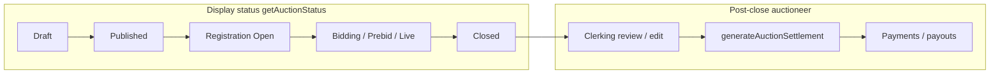

[Auction Journal](../index.md)

# Auction lifecycle and stages

User guide: [What are the different stages of an auction?](../user_side_doc/auction/auction-stages.md).

This page documents **display status** (auction list badges), **internal edit phases** (field locking), and **post-close** flow (clerking → settlement → payment). Status logic is implemented in the auctioneer dashboard; server jobs enforce close and clerking.

---

## Two layers of “stage”

| Layer | Source | Used for |
|-------|--------|----------|
| **Display status** | `getAuctionStatus` — `auctioneer_dashboard_revamp/src/lib/helper/auction.js` | Badge text and colors on auction cards, dashboard, **START YOUR LIVE AUCTION** (`isOnsiteLive`, `isAuctionClosed`) |
| **Edit phase** | `getCurrentAuctionCondition` — `src/hooks/edit_auction_disable_context.js` | Which build/lot fields are disabled after publish (`handleAuctionEditDisable`) |

Display labels and edit phases use the **same clocks** (`startDate`, `endDate`, `OpenBidding`, `closebidding`, onsite `biddingTimmings`, pre-bid) but **different granularities** (for example online edit uses `FIVE_MIN_BEFORE_SOFTCLOSE` / `SOFTCLOSE_STARTED`; badges show **Bidding Open** and **Soft Close** only).

---

## `getAuctionStatus` — display status

Returns `{ status, backgroundColor, color, isOnsiteLive?, isAuctionClosed? }`.

### Unpublished

| Condition | `status` |
|-----------|----------|
| `!isPublished` | **Draft** |

### Published, before listing

| Condition | `status` | Colors |
|-----------|----------|--------|
| `now < startDate` | **Published** | Gray bg / black text |

### Closed (all types)

| Condition | `status` | Notes |
|-----------|----------|--------|
| `now > endDate` | **Closed** | Red badge |
| Onsite: no non-closed `biddingTimmings` | **Closed** | Sets `isAuctionClosed: true` even if `endDate` not passed |

### Online Timed / Absolute / Absentee (`AuctionType !== "Onsite With Live Webcast"`)

Requires `now` between `startDate` and `endDate`:

| Condition | `status` |
|-----------|----------|
| `now < OpenBidding` | **Registration Open** |
| `now < closebidding` | **Bidding Open** |
| `now < endDate` | **Soft Close** — see [Soft close](./soft-close.md) |
| else | **Error** (unexpected window) |

### Onsite With Live Webcast

| Condition | `status` | Flags |
|-----------|----------|--------|
| Before pre-bid start (if pre-bid) or before first bidding day | **Registration Open** | |
| Pre-bid on and `now < first bidding day` | **Prebidding Open** | |
| No upcoming non-closed bidding day | **Closed** | `isAuctionClosed: true` |
| `now < nextOnsiteBidding` | **Prebidding Open** or **Registration Open** | Depends on `isPreBiddingAllowed` |
| else (on bidding day window) | **Live** | `isOnsiteLive: true` |

`nextOnsiteBidding` = minimum `startAt` among `biddingTimmings` where `!isClosed`.

---

## `getCurrentAuctionCondition` — edit phases

Enum in `edit_auction_disable_context.js`:

```text
DRAFT → PUBLISHED → REGISTRATION_STARTED → … → AUCTION_CLOSED
```

### Online timed / absolute

| Phase | Time rule (simplified) |
|-------|-------------------------|
| `DRAFT` | `!isPublished` |
| `PUBLISHED` | `now < startDate` |
| `REGISTRATION_STARTED` | `now < OpenBidding` |
| `BIDDING_OPEN` | `now < closebidding - 5 minutes` |
| `FIVE_MIN_BEFORE_SOFTCLOSE` | `now < closebidding` |
| `SOFTCLOSE_STARTED` | `now < endDate` |
| `AUCTION_CLOSED` | `now >= endDate` |

### Onsite with live webcast

| Phase | Time rule (simplified) |
|-------|-------------------------|
| `REGISTRATION_STARTED` | Before pre-bid (if any) or first bidding day |
| `PRE_BIDDING_OPEN` | Pre-bid enabled, before first bidding day |
| `FIRST_BIDDING_OPEN` | After first day, before next non-closed day (between days) |
| `ONSITE_BIDDING_OPEN` | Active bidding day (`nextOnsiteBidding` reached) |
| `AUCTION_CLOSED` | No `nextOnsiteBidding` or `now > endDate` |

Cumulative field locks per phase: see [Auction build § Edit after publish](./build.md#edit-after-publish) and full `handleAuctionEditDisable` in the hook file.

---

## Stage diagram (product flow)



---

## Backend lifecycle events (summary)

Operational detail lives in jobs and controllers; high level:

| Event | Effect |
|-------|--------|
| **Registration / listing start** | `startDate` reached; bidders can register; caches updated ([Registration](./registration.md)) |
| **Open bidding** (online) | Timed/Absolute: bidding window opens; featured auction cache invalidation |
| **Live webcast day** (onsite) | `enterARing`; ring session `isLive` ([Ring](./onsite-livewebcast/ring.md)) |
| **Soft close** (online) | Per-lot close scheduling after `closebidding` |
| **Auction end** | `Status: Closed`, cache clear, `lotsClerkingAfterAuctionEnd` ([Post-close](./post-close.md)) |

---

## Post-close sequence (auctioneer)

Aligned with product intent and existing docs:

1. **Closed** — `endDate` passed and/or onsite bidding days exhausted; display **Closed**.
2. **Clerking** — Auto defaults for lots without `clerkStatus`; manual **edit clerking** allowed after close until settlement/payment rules block ([Clerking](./clerking.md)).
3. **Settlement** — One-time **generate** when eligible (`isSettlementGenerated` false, hold lots resolved) ([Settlement](./settlement/index.md), [Post-close §3](./post-close.md)).
4. **Payment** — Buyer settlement payment and seller payouts via Stripe Connect ([Payment](../payment/index.md)).

**Order:** Clerking should be correct **before** generate when invoices are expected; clerking edits **after** settlement update settlements asynchronously unless payment already started.

---

## Implementation reference

| Concern | Path |
|---------|------|
| Display status | `auctioneer_dashboard_revamp/src/lib/helper/auction.js` — `getAuctionStatus` |
| Edit phases | `auctioneer_dashboard_revamp/src/hooks/edit_auction_disable_context.js` |
| Publish / dates | `AJ-Main-Backend/app/controllers/auctionOperations/build-auction.js` |
| Auction end / clerking batch | `auction-events.js`, `auction-lot/actions/clerking.js` (see [post-close](./post-close.md)) |
| Settlement generate | `settlement/index.js` — `generateAuctionSettlement` |
| Live ring enter | `live-webcast.js` — `enterARing` (checks bidding day) |

---

## Related

- [Auction build](./build.md)
- [After the auction closes](./post-close.md)
- [Clerking](./clerking.md)
- [Settlement](./settlement/index.md)
- [Rings](./onsite-livewebcast/ring.md)
