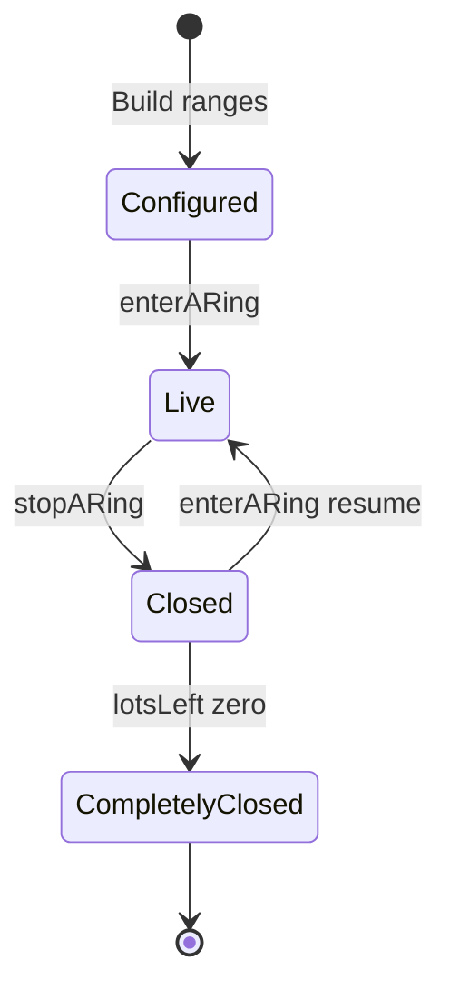

[Auction Journal](../../index.md) · [Onsite live webcast](./index.md)

# Live webcast — rings

User guide: [How does Ring work in an auction?](../../user_side_doc/auction/rings.md).

## Business purpose

**Onsite With Live Webcast** auctions can split lots into **rings** — numbered segments of the catalog (by **lot number** or **sale order** range). On each **bidding day**, the auctioneer **enters** one ring at a time, clerks lots in that range, then **closes** the ring. When every lot in the ring is clerked (**Sold** or **Pass**), the ring becomes **completely closed** and cannot be re-entered.

Rings exist only for this auction type. Online timed/absolute and absentee auctions do not use `ringOptions`.

---

## Data on `auctionDetails`

| Field | Notes |
|-------|--------|
| `isMultipleRingAuction` | `false` at create; auctioneer enables in build UI |
| `ringOptionAssignBy` | `"range by lot number"` (default) or `"range by sale order"` |
| `ringOptions[]` | Per ring: `rangeBegin`, `rangeEnd`, `lotCount`, `lotsLeft`, `liveWebcast` (ObjectId), `isRingLive`, `isRingPaused`, `isClosed`, `isCompletelyClosed` |

**Model:** `AJ-Main-Backend/app/models/auctionDetails.js` (ring fields).

**Runtime ring session:** `auctionLiveWebcast` — one document per auction + `ring` number (1-based). Linked from `ringOptions[ringIndex].liveWebcast`.

---

## Build-time (auctioneer dashboard)

| Piece | Location |
|-------|----------|
| Enable multiple rings | `BuildAuction/AuctionInfo` — checkbox **Auction Will Have Multiple Rings** (`isMultipleRingAuction`); clearing `ringOptions` when toggled on |
| Ring UI | `BuildAuction/RingOption/index.jsx` — shown when `AuctionType === "Onsite With Live Webcast"` && `isMultipleRingAuction` (`Details/index.jsx`) |
| Assign by | Radio `ringOptionAssignBy` — disabled when single-ring |
| Ranges | Modal `BuildRange`: `rangeBegin`, `rangeEnd`; client overlap validation; delete only last row |
| Tooltip | Sold lots cannot reopen in any ring |

**Draft/publish payload:** `build-auction.js` merges `isMultipleRingAuction`, `ringOptionAssignBy`, `ringOptions` on draft edit and published update.

**On create (onsite):** `createAuctionTemplate` sets `isMultipleRingAuction: false`, `ringOptionAssignBy: "range by lot number"`, `ringOptions: []`.

### Publish validation — `auctionRingOptionsValidation`

`AJ-Main-Backend/app/controllers/auctionOperations/auction-ring.js` — called from publish flow when `isMultipleRingAuction` is true:

- At least one ring row required.
- Every catalogued lot’s lot# or sale order (per `ringOptionAssignBy`) must fall in exactly one range.
- No **gaps** between consecutive ranges (`rangeBegin - previousRangeEnd > 1` fails).
- No empty rings (for catalogued / when lots exist).
- Highest lot/sale order may extend the last ring’s `rangeEnd` automatically before validation.

### Lot counts — `updateAuctionRingLotsCount`

Same controller; `updateType`:

| Type | Behavior |
|------|----------|
| `INITIAL_SETUP` | **Single ring:** one row with min/max lot# (aggregate) and ready lot count. **Multi ring:** `lotCount` / `lotsLeft` per range from ready lots. |
| `RECOUNT` | Recompute counts; adjust for clerked lots and lots opened in a different ring than their range (`isItOfDiffRing`). Updates linked `auctionLiveWebcast.lotsLeft`. |

Triggered via job event `AUCTION_RINGS_UPDATE` after ring close and related lot changes.

**Helper on build:** `livewebcastRingsetupOnAuctionbuild` in `build-auction.js` prepares `ringOptions` with counts at publish.

---

## Live day — enter / stop ring

### Dashboard

`LiveWebcastAuction/StartLiveAuction/index.jsx`:

- **START YOUR LIVE AUCTION** when onsite bidding day is active.
- **Multi ring (>1 row):** step 1 `SelectRing` → step 2 `SelectStreamingInputDevices` → API → new tab `/dashboard/auction/clerking/livewebcast/{ringNumber}`.
- **Single ring:** skip ring picker; `ringIndex` 0.
- `enterARingOfLiveWebcast` → `POST /api/auctioneer/auction/livewebcast/enter-ring`.

`SelectRing` shows status from `ringOptions` (`isRingLive`, `isClosed`, `isCompletelyClosed`, `lotsLeft`) and blocks live/fully closed rings.

### `enterARing` — `live-webcast.js`

**Body:** `{ auctionId, ringIndex }` (0-based index into `auction.ringOptions`).

**Checks:**

- Live webcast socket server up (`LIVEWEBCAST_SOCKET_URL/api/status`).
- Auctioneer owns auction; published; not past `endDate`.
- Active **bidding day** (`biddingTimmings` — earliest non-closed `startAt` must be ≤ now).
- Ring exists; not `isCompletelyClosed`; not already `isLive` on `auctionLiveWebcast`.

**Effects:**

- Create or resume `AuctionLiveWebcast` for `ring: ringIndex + 1` (`isLive: true`, `isPaused: true` on resume, floor bidder flag, increment pattern).
- Set `ringOptions[ringIndex].isRingLive`, `liveWebcast`, `isClosed: false`, refresh `lotsLeft`.
- Schedule **end-of-day** auto-close cron (`auctionLiveWebcastAutoCloseCronjob`).

**Routes:** `app/routes/auction-livewebcast.js` — `POST .../enter-ring`, `POST .../stop-ring`.

### `stopARing` / `closeAuctionLiveWebcastRing`

**Body:** `{ liveRingId, isPauseOnly? }`.

- Sets ring session `isLive: false`, `isClosed: true`; clears live lot unless pause-only.
- Updates `ringOptions[ringIndex].isRingLive = false`, `isClosed = true`.
- If `lotsLeft < 1` and `isMultipleRingAuction` → `isCompletelyClosed` on ring option + live webcast doc.
- `lotLeavingLivewebcastRing` when closing with a live lot.
- Queues `AUCTION_RINGS_UPDATE` / `RECOUNT`.

**Pause vs close:** `isPauseOnly` keeps live lot reference; full close clears it.

---

## Lots in a ring

**Next lot in ring:** `getNextLotToOpen` in `lot/live-webcast.js` filters by `ringOptionAssignBy` field (`lotNumber` or `saleOrder`) between `rangeBegin` and `rangeEnd`, excludes clerked lots, sorts by `saleOrder`.

**Public “upcoming lots in ring”:** lots in range not clerked — see existing § in prior doc stub (bidder ring page).

---

## Ring lifecycle (summary)

| State (UI) | `ringOptions` / `auctionLiveWebcast` |
|------------|--------------------------------------|
| Not started | No `isRingLive` |
| Live | `isRingLive`, `auctionLiveWebcast.isLive` |
| Closed (session) | `isClosed`, not live |
| Completely closed | `isCompletelyClosed` — cannot `enterARing` |

---

## Related code

| Area | Path |
|------|------|
| Enter / stop / fetch ring | `controllers/auctionOperations/live-webcast.js` |
| Validation & counts | `controllers/auctionOperations/auction-ring.js` |
| Build merge / publish setup | `controllers/auctionOperations/build-auction.js` |
| Ring UI | `auctioneer_dashboard_revamp/.../BuildAuction/RingOption/` |
| Start live | `.../LiveWebcastAuction/StartLiveAuction/` |
| Socket room | Ring id = live webcast id (see session doc) |

---

## Operations checklist (auctioneer)

1. **Prepare** — Onsite auction, bidding day active, rings configured (or single-ring auto range at publish).
2. **Enter ring** — `enterARing` after device test; join socket room.
3. **Clerk lots** — only lots in ring range (next-lot logic).
4. **Close ring** — `stopARing`; if all lots clerked → completely closed.
5. **Next ring** — repeat for another range when multi-ring.

See also [Session Operation](./session.md), [Lot Operations](../../auction-lot/onsite-livewebcast/index.md).
