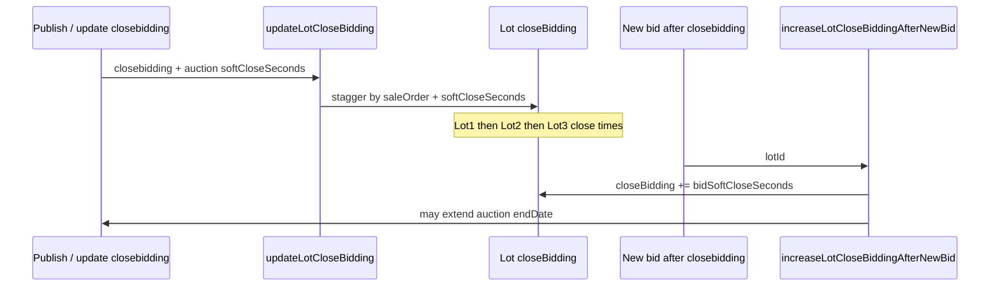

[Auction Journal](../index.md)

# Soft close (online timed / absolute)

User guide: [Soft close and bid soft close](../user_side_doc/auction/soft-close.md).

**Scope:** Online auctions with `OpenBidding` / `closebidding` / per-lot `closeBidding`. **Not** used for `Onsite With Live Webcast` (`increaseLotCloseBiddingAfterNewBid` returns immediately for onsite).

---

## Business purpose

After the auction-wide **close bidding** datetime:

1. **Soft close seconds** — stagger each lot’s close time by **sale order** so lots end **one by one**.
2. **Bid soft close seconds** — when a bid arrives **during** soft close (after `auction.closebidding`), **extend** that lot’s `closeBidding` by the lot’s `bidSoftCloseSeconds`.

Auction **`endDate`** is the last lot’s scheduled close (computed at publish / when close schedule is recalculated).

---

## Data model

**Auction** (`auctionDetails`): `softCloseSeconds`, `bidSoftCloseSeconds` (and optional `softCloseMilliSecs`, `bidSoftCloseMilliSecs`), `closebidding`, `endDate`, `autoSyncGroupedLotSoftCloseTime`.

**Lot** (`lots`): same second/millisecond fields; `closeBidding` (per-lot actual close instant); `defaultsFieldsFromAuction` may include `softCloseSeconds` / `bidSoftCloseSeconds` until overridden on edit.

**Format:** `hh:mm:ss` string; publish Joi caps each at **72 hours**.

---

## Auctioneer UI

`auctioneer_dashboard_revamp/src/Components/Auctions/BuildAuction/Bidding/index.jsx` (non-onsite branch):

| Field | Tooltip / behavior |
|-------|-------------------|
| **Closed Bidding** | “Lots start closing one by one, based on the soft close seconds.” |
| **Soft Close Seconds** | Stagger between lot closes |
| **Bid Soft Closed Seconds** | Extra seconds on lots that receive bids after close bidding during soft close; UI notes empty auction value → lots follow default soft close for extension intent |

Onsite branch shows **bidding timings** only — no soft-close fields.

---

## Schedule lots: `updateLotCloseBidding`

**File:** `AJ-Main-Backend/app/controllers/auctionOperations/lot/lot-build.js`

```text
updateLotCloseBidding(auctionId, closebidding, auctionSoftCloseSeconds)
  → findCloseTimes(lots sorted by saleOrder)
  → bulkWrite each lot.closeBidding (+ copy auction softCloseSeconds if lot missing)
  → return highestClosingDate
```

**`findCloseTimes` logic:**

- Start `lotCloseBidding = auctionCloseBidding` (auction `closebidding`).
- For each lot in **sale order**: add that lot’s `softCloseSeconds` (or auction default) in seconds to the running time; assign result to `lot.closeBidding`.
- Last iteration’s time = **`highestClosingDate`** → stored as auction **`endDate`**.

**Called from:**

- `publishAuctionDetails` when auction has lots and type ≠ Onsite (`build-auction.js`).
- `updatePublishedAuction` when `closebidding` or `softCloseSeconds` changes (non-onsite).

**Mass sync:** `setLotSoftClose` updates auction + **all** non-QR lots with new `softCloseSeconds` / `bidSoftCloseSeconds`.

**New lots:** Creation paths copy auction soft-close fields onto the lot payload (`lot-build.js` assistant/create flows).

---

## Extend on bid: `increaseLotCloseBiddingAfterNewBid`

**File:** `AJ-Main-Backend/app/controllers/bidding/online-timed-auction.js`

Invoked (fire-and-forget) after successful bids on timed/absolute paths.

| Step | Behavior |
|------|----------|
| Load lot | `closeBidding`, `bidSoftCloseSeconds`, auction `closebidding`, `endDate` |
| Onsite | **Return** — no extension |
| `findNewCloseBidding` | If `now < auction.closebidding` → **null** (no extension). Else `newClose = lot.closeBidding + bidSoftCloseSeconds` |
| Persist | `Lots.update` `closeBidding` if changed |
| Redis / pub | `publishAuctionLotNewclose(auctionId, lotId, newClose, newEndDate?)` — ZADD `auction:{id}:closingSchedule`; optional `LOT_EXTENDED` event if `endDate` moves |
| Auction | If new close &gt; `endDate`, `Auction.endDate = newClose` |

**`publishAuctionLotNewclose`:** `newAuctionLotsRedisPubSub/publisher.js` — sorted set of lot close times for workers/stream consumers.

---

## Soft-close phase (runtime)

| Piece | Role |
|-------|------|
| `getAuctionStatus` | After `closebidding`, before `endDate` → display **Soft Close** |
| `auctionPreSoftclose` / `preSoftCloseStartAction` | `softclose.js` — load all lot `closeBidding` into Redis `auction:{auctionId}:closingSchedule` |
| Per-lot close | Worker/stream closes lot at scheduled score; last lot drives auction end |
| `auctionEnd` | `auction-events.js` — status Closed, clerking batch, cache clear |

Detail of workers: operational; see [Lifecycle](./lifecycle.md) and [Post-close](./post-close.md).

---

## Lot-level overrides

`updateLot` accepts `softCloseSeconds` / `bidSoftCloseSeconds`; changing them removes the field from `defaultsFieldsFromAuction`. Recalculating close times after a single-lot sale-order change is partially commented in code — publish / auction-level close changes trigger full `updateLotCloseBidding`.

---

## Flow diagram



---

## Implementation reference

| Function / module | Path |
|-------------------|------|
| `updateLotCloseBidding`, `findCloseTimes`, `setLotSoftClose` | `controllers/auctionOperations/lot/lot-build.js` |
| `increaseLotCloseBiddingAfterNewBid`, `findNewCloseBidding` | `controllers/bidding/online-timed-auction.js` |
| `publishAuctionLotNewclose` | `newAuctionLotsRedisPubSub/publisher.js` |
| `preSoftCloseStartAction` | `controllers/auctionOperations/softclose.js` |
| Publish hook | `controllers/auctionOperations/build-auction.js` |
| Validation | `controllers/auctionOperations/auction.validation.js` |
| Display status | `auctioneer_dashboard_revamp/src/lib/helper/auction.js` |

---

## Related

- [Auction build](./build.md)
- [Lifecycle / stages](./lifecycle.md)
- [Post-close](./post-close.md)
