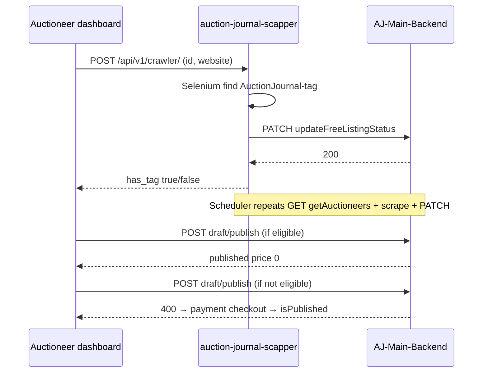

[Auction Journal](../index.md)

# Free Listing Eligibility

Auctioneers normally pay a **listing package price** (from app settings) to publish a listing. When **`isEligibleForFreeListing`** is `true`, publish paths set **`price: 0`** and skip paid checkout. Eligibility is earned by hosting the **Auction Journal “Powered by”** image tag on the auctioneer’s own website and passing verification.

**User steps and screenshots:** [Can I publish my listing for free?](../user_side_doc/listing/free-listing.md)

---

## Business rules

| Topic | Behavior |
|--------|----------|
| Default publish | Listing drafts store `price` from `appSetting.listingPrice` when created/updated. |
| Free publish | If `auctioneer.isEligibleForFreeListing === true`, draft publish sets `price: 0` and publishes without payment. |
| Paid publish | If not eligible, `POST …/listing/draft/publish` returns `400` with `isEligibleForFreeListing: false`. Dashboard opens payment UI; after Stripe checkout, payment handler sets `isPublished: true` on the listing. |
| Eligibility loss | Recurring checks can set `isEligibleForFreeListing` to `false`. **Already published listings stay published.** New publishes require payment again until eligibility is restored. |
| Tag requirement | Scraper looks for `` with `src` matching configured `EXPECTED_SRC_URL` (see scrapper env). |

---

## Auctioneer fields (`Auctioneer` model)

| Field | Purpose |
|--------|---------|
| `isEligibleForFreeListing` | Gate for free publish and `createListing` shortcut. |
| `websiteWithTag` | Homepage URL the auctioneer submitted for verification; used by recurring jobs. |

Returned on login for dashboard context (`login.js`).

---

## Dashboard UI (`auctioneer_dashboard_revamp`)

| Item | Location |
|------|----------|
| Route | `/dashboard/listing/free-listing` → `Pages/Listing/freeListing.page.jsx` |
| Component | `Components/Listing/FreeListing/index.jsx` |
| Nav | `navigationLinks.js` → **Listings** ▾ → **Free Listing** |
| HTML snippet | `img` with `class='AuctionJournal-{AuctioneerID}'` and CloudFront `powered_by_aj.svg` |
| Verify button | `POST` scrapper `REACT_APP_BASE_URL_SCRAPPER/api/v1/crawler/` with `{ auctioneer_id, website }` |
| On verify success | Updates client user context: `isEligibleForFreeListing`, `websiteWithTag` from response |
| Publish without pay | `ListingCard` → `publishListingDraft`; on `isEligibleForFreeListing === false` opens `BuildListing/PaymentOption` (free path link or paid checkout) |

---

## Scrapper service (`auction-journal-scapper`)

Two entry points share `scrap_website_for_tag_and_update_auctioneer_in_db`:

1. **On-demand (dashboard Verify)** — `POST /api/v1/crawler/` (`crawl_endpoint.py`)  
   - Body: `auctioneer_id`, `website`  
   - Selenium loads site, finds `img.AuctionJournal-{auctioneer_id}`, checks display/opacity/`src`  
   - Calls backend `PATCH …/updateFreeListingStatus`  
   - Returns `{ auctioneer_id, has_tag, website }` or `400` if tag missing  

2. **Recurring** — `scheduler.py`  
   - `GET …/getAuctioneers` (auctioneers with non-empty `websiteWithTag`)  
   - Re-runs scrape + `updateFreeListingStatus` per row (interval from `SCHEDULER_INTERVAL_IN_DAYS` env; code may use minutes in test)  

Backend integration: `helpers/aj_service.py` → `get_auctioneer_details`, `update_auctioneer_details`.

---

## Backend APIs (`AJ-Main-Backend`)

Mounted on listing router (`app/routes/listing-build.js`). All scrapper routes require header **`apikey`** = `API_KEY_FOR_AJ_SCRAPPER`.

| Method | Path | Handler | Notes |
|--------|------|---------|--------|
| `PATCH` | `/api/auctioneer/listing/updateFreeListingStatus` | `freeListingStatus.updateFreeListingStatus` | Body: `auctioneerId`, `status` (bool or `"true"`/`"false"`), `website` → sets `isEligibleForFreeListing`, `websiteWithTag` |
| `GET` | `/api/auctioneer/listing/getAuctioneers` | `getAuctioneers` | Returns auctioneers where `websiteWithTag` ≠ `""` |
| `PATCH` | `/api/auctioneer/listing/updateAuctioneersFreeEligibilityStatus` | `updateAuctioneersFreeEligibilityStatus` | Bulk shape documented; **bulk write not fully implemented** in controller |

### Listing publish / create gates

| Endpoint | File | Eligibility use |
|----------|------|-------------------|
| `POST /api/auctioneer/listing/draft/publish` | `listing-draft.js` → `removeUnPublishedAndAddListing` | Blocks if not eligible; if eligible sets `price: 0` |
| `POST /api/auctioneer/listing/create` | `listing-build.js` → `createListing` | Requires eligible; creates published listing at `price: 0` |
| Payment success | `paymentAndBilling/payment.js` | `productType: "listing"` → `isPublished: true` (paid path, no eligibility flag required) |

Draft create/edit sets `payload.price = appSetting.listingPrice` (`listing-draft.js`).

---

## Flow (summary)

---

## Related docs

- [Listing module](../listing/index.md) — lifecycle, paid vs free publish  
- [Listing fields / price](../listing/index.md) — `listingPrice` from app settings  
- [Auctioneer fields](./fields.md) — `isEligibleForFreeListing`, `websiteWithTag`
