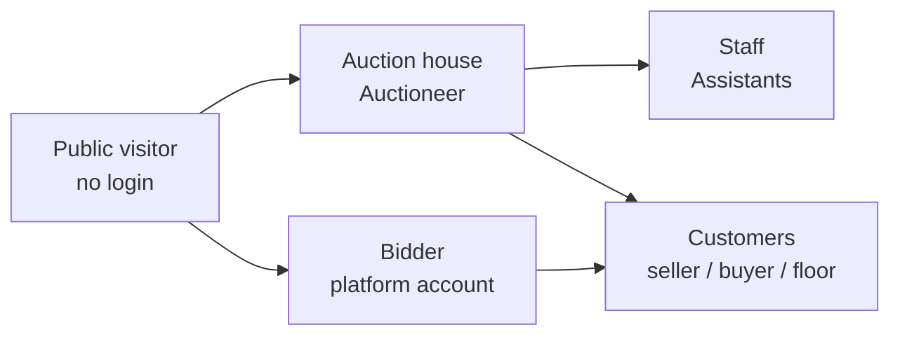
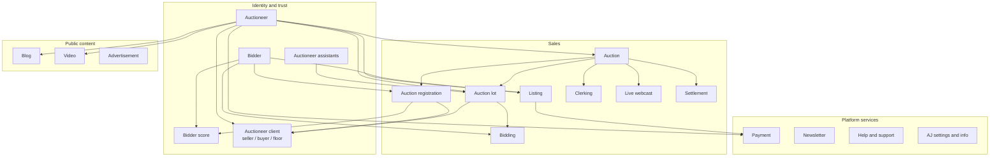

[Auction Journal](index.md)

# Auction Journal and module relations

Platform overview for developers: what Auction Journal (AJ) is, who uses it, how **customers** relate to **auctioneers** and **bidders**, and how feature modules connect. For apps and infrastructure, see [System Architecture](system-architecture.md). For implementation detail, follow the module links in [Documentation map](#documentation-map) below.

## What is Auction Journal?

**Auction Journal** is a web platform for **running auctions and bidding** online and onsite. It connects:

- **Auction houses** — auctioneer businesses that run sales
- **Bidders** — buyers who register and compete on the public site
- **The public** — anyone who can browse marketing content and sale information without signing in

Auctioneers use the **auctioneer dashboard** to operate their business. Bidders use the **public website** (and bidder dashboard after login). Internal staff use the **admin panel**; platform configuration lives under **AJ settings**.

## Core idea: auction house and customers

An **auctioneer** account represents an **auction house** — the company that conducts sales on AJ.

Each auctioneer maintains **customers** in CRM as **auctioneer clients** (`clientsOfAuctioneer`). A client is always **scoped to one auctioneer**; the same person can be different client records under different auction houses.

| Client role (can combine on one profile) | Business meaning | Typical participation |
|------------------------------------------|------------------|------------------------|
| **Seller / consigner** | Party whose goods are sold at auction; lot `seller` points to this client | Settlement, commissions, consigner accounting |
| **Buyer (online)** | Linked to a platform **Bidder** (`buyerRef`, `isBuyer`) | Registers on public site, bids online, settlement as internet bidder |
| **Buyer (floor / onsite)** | **Floor bidder** client (`isFloorBidder`); not a platform bidder login | Checked in on live/onsite sales; auctioneer staff enters bids during clerking/webcast |
| **Both seller and buyer** | One CRM profile with consigner and buyer flags | Common when a consigner also buys at the same house |

**Bidder vs customer:** A **bidder** is a **platform-wide** identity. A **customer (client)** is **per auctioneer**. When a bidder registers for an auction, the system creates or updates that auctioneer’s client and links `buyerRef`. See [Bidder vs client](auctioneer-client/bidder-relationship.md) and [Floor bidder](auctioneer-client/floor-bidder.md).

Online and floor paths stay **separate account models** for registration and settlement; they are not merged into one registration row without explicit product rules. See [Auction registration](auction/registration.md).

## Who uses the platform?

| Actor | Account type | Primary app | What they do on AJ |
|-------|--------------|-------------|-------------------|
| **Auctioneer** | Auctioneer business | `auctioneer_dashboard_revamp` | Listings, auctions, lots, clerking, settlement, clients, content, payments setup |
| **Auctioneer assistant** | `auctioneerassistant` under one auctioneer | Dashboard (+ **lot-ai** for fast catalog) | Delegated dashboard work; can **upload / seed auction lots** on behalf of the auctioneer (fast catalog, batch images) before lots are completed and marked auction-ready |
| **Bidder** | Platform bidder | `auctionjournal-public` | Browse, register for auctions, bid (timed / live webcast per auction type), manage profile and verification |
| **Public user** | None (anonymous) | `auctionjournal-public` | View listings, auctions, blogs, videos, auctioneer profiles, and public catalog without bidding |
| **Admin** | Admin user | `aj-adminpanel-client` | Internal platform operations via `AJ-AdminPanel-Backend` |

Assistants are **tenant-bound**: one assistant belongs to one auctioneer; invitation and disable rules are in [Auctioneer assistants](auctioneer-assistants/index.md). **Lot AI** (`lot-ai`) supports assistants (and auctioneers) in completing minimal lots after fast catalog upload — see [Auction lot build](auction-lot/build.md).

## What auctioneers and bidders can do (by module)

### Auctioneer-operated (dashboard)

| Area | Module doc | Summary |
|------|------------|---------|
| **Listings** | [Listing](listing/index.md) | Market property or assets; public lead surface **separate from** auction lifecycle |
| **Auctions** | [Auction](auction/index.md) | Timed, live webcast, onsite, and related sale types; registration, clerking, post-close, settlement |
| **Auction lots** | [Auction lot](auction-lot/index.md) | Catalog lines, bidding, watchlist; tied to an auction |
| **Customers** | [Auctioneer client](auctioneer-client/index.md) | Sellers, buyers, floor bidders, mailing lists |
| **Content** | [Blog](blog/index.md), [Video](video/index.md) | Marketing and education on the public site |
| **Monetization / platform** | [Advertisement](advertisement/index.md), [Payment](payment/index.md) | Paid listings/ads, Stripe Connect, checkout |
| **Operations** | [Auctioneer misc](auctioneer-misc/index.md), [Help and support](help-and-support/index.md) | Formulas, accounts, templates, support channels |
| **Team** | [Auctioneer assistants](auctioneer-assistants/index.md) | Invites, roles, delegated catalog work |

### Bidder and public (website)

| Area | Module doc | Summary |
|------|------------|---------|
| **Discover** | Public routes + auction/listing modules | Search and view auctions, lots, listings, blogs, videos |
| **Listing participation** | [Listing](listing/index.md) | Depends on listing type: e.g. bid pass for onsite listing vs callback request |
| **Auction participation** | [Bidder](bidder/index.md), [Auction registration](auction/registration.md), [Bidding](auction-lot/bidding/index.md) | Register → approval → bid; verification and [bidder score](bidder-score/index.md) where enforced |
| **Account** | [Bidder profile](bidder/profile.md), [Verification](bidder/verification.md) | Identity and card-on-file for verified bidding |

## Module relationships

Modules are **not all nested inside “Auction”**. Treat **Listing** as its own product area. **Auction** owns **Auction lot**, **Registration**, **Clerking**, **Live webcast**, and **Settlement**. **Auctioneer client** cuts across auctions (seller on lots, buyer on registrations). **Payment** and **Blob** support multiple modules (listing publish, ads, media).

### Listing vs auction

| | **Listing** | **Auction** |
|---|-------------|-------------|
| **Purpose** | Advertise assets; capture bidder interest before or beside a formal sale | Run a sale event with lots, bidding, and close/settlement |
| **Lifecycle** | Draft → published → live → past (by listing rules) | Build → publish → live bidding → close → settlement |
| **Bidder action** | Type-driven (e.g. onsite bid pass vs callback) | Registration, approval, then lot bidding |
| **Doc entry** | [listing/index.md](listing/index.md) | [auction/index.md](auction/index.md) |

An auctioneer may use **both** for the same business: listings for marketing, auctions for the actual competitive sale.

### Auction internal chain

Typical dependency order for a sale:

1. **Auctioneer** configures misc (formulas, Stripe, templates).
2. **Auction** created and configured ([Build](auction/build.md)).
3. **Auction lots** catalogued ([Build](auction-lot/build.md)); **seller** client on each lot where applicable.
4. **Publish** auction (readiness rules for catalogued vs non-catalogued).
5. **Registration** — online bidders and/or **floor** clients checked in.
6. **Bidding** — timed online and/or **live webcast** ([Onsite live webcast](auction/onsite-livewebcast/index.md)).
7. **Clerking** during/after sale.
8. **Settlement** — buyer/seller invoices per registration and sold lots ([Settlement](auction/settlement.md)).

### Content on the public site

**Blog**, **video**, and **advertisement** modules feed the **public website** and discovery; they do not replace auction or listing workflows. Auctioneer branding and FAQs tie back to [Auctioneer](auctioneeer/index.md) profile modules.

### Shared authentication

[Authentication](auth/index.md) covers password flows shared across apps (e.g. forgot password). Login surfaces differ by role: auctioneer, assistant, bidder, admin.

## Documentation map

Use this table as the module index aligned with [index.md](index.md).

| Group | Topics | Dev doc entry |
|-------|--------|----------------|
| **Platform** | This page, apps, infra | [auctionjournal.md](auctionjournal.md), [system-architecture.md](system-architecture.md) |
| **Auth** | Forgot password, shared auth | [auth/index.md](auth/index.md) |
| **Auctioneer** | Registration, profile, free listing, FAQs | [auctioneeer/index.md](auctioneeer/index.md) |
| **Assistants** | Invite, access, lot upload delegation | [auctioneer-assistants/index.md](auctioneer-assistants/index.md) |
| **Bidder** | Registration, profile, verification | [bidder/index.md](bidder/index.md) |
| **Bidder score** | Trust events | [bidder-score/index.md](bidder-score/index.md) |
| **Customers** | Build, paths, floor, mailing list | [auctioneer-client/index.md](auctioneer-client/index.md) |
| **Listing** | Create, manage, fields | [listing/index.md](listing/index.md) |
| **Auction** | Build, registration, clerking, live webcast, settlement | [auction/index.md](auction/index.md) |
| **Auction lot** | Fields, build, bidding, watchlist | [auction-lot/index.md](auction-lot/index.md) |
| **Video / blog** | Content publishing | [video/index.md](video/index.md), [blog/index.md](blog/index.md) |
| **Advertisement** | Paid placement | [advertisement/index.md](advertisement/index.md) |
| **Payment** | Cards, Stripe Connect, checkout | [payment/index.md](payment/index.md) |
| **Newsletter** | Subscriptions | [newsletter/index.md](newsletter/index.md) |
| **Help** | Callback, email, chat, tickets | [help-and-support/index.md](help-and-support/index.md) |
| **Settings** | Platform-wide AJ info | [aj-settings-and-info/index.md](aj-settings-and-info/index.md) |
| **Blob** | Media upload service | _(docs pending — see `auction_journal_blobs` and architecture)_ |

End-user guides for the same topics (where they exist) live under [`user_side_doc`](user_side_doc/index.md); they explain **how to use** the product, not module wiring.

## Quick reference: your inputs mapped

| Statement | Where it lives in AJ |
|-----------|----------------------|
| Auction and bidding web app for auctioneers and bidders | Core platform; [Bidder](bidder/index.md) + [Auction](auction/index.md) + [Bidding](auction-lot/bidding/index.md) |
| Auctioneers post listing, auction, blogs, video | [Listing](listing/index.md), [Auction](auction/index.md), [Blog](blog/index.md), [Video](video/index.md) |
| Bidders bid on auction, participate in listing | [Bidding](auction-lot/bidding/index.md), [Listing](listing/index.md) |
| Public can view everything on public website | `auctionjournal-public`; read-only discovery of published content and catalogs |
| Assistants upload lots on behalf of auctioneer | [Auctioneer assistants](auctioneer-assistants/index.md), [Auction lot build](auction-lot/build.md) § fast catalog; optional [Lot AI](auction-lot/build-lot-ai.md) |
| Seller/consigner customers; customer can also be buyer | [Auctioneer client](auctioneer-client/index.md); lot `seller`; buyer/floor flags |
| Online bidder vs onsite floor bidder customer | [Bidder](bidder/index.md) vs [Floor bidder](auctioneer-client/floor-bidder.md); [Registration](auction/registration.md) |
| Auctioneer is the auction house | [Auctioneer](auctioneeer/index.md) tenant; all clients and auctions scoped to that account |
