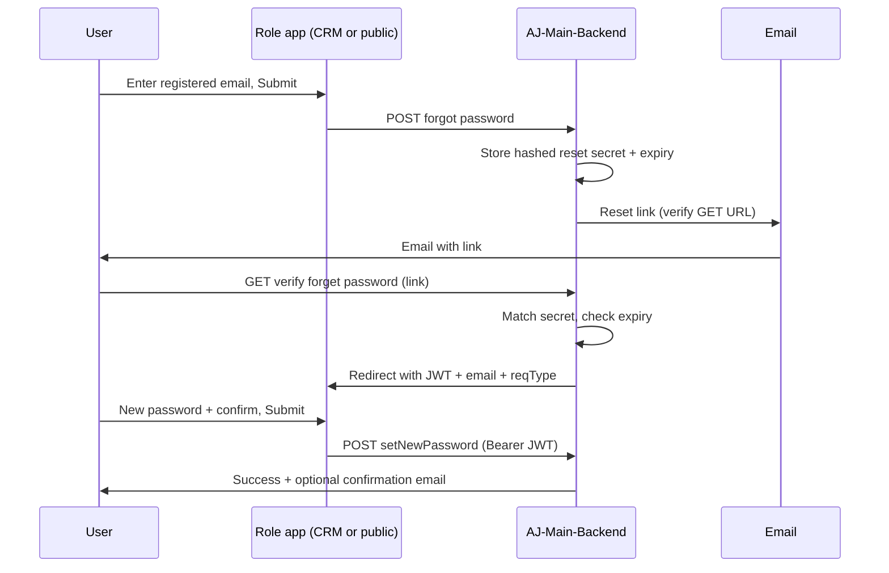

[Authentication](./index.md) · [Auction Journal](../index.md)

# Forgot password (auctioneer and bidder)

Password recovery is a **three-phase** flow: request reset by **registered email**, open a **link in email** (backend validates token material and issues a short-lived **JWT**), then enter a **new password** on the role’s site. Auctioneer and bidder share the same controllers with different routes, email templates, redirects, and `reqType` on the final save.

**Backend:** `forgetPassword.js` (`forgotPasswordAuctioneer`, `forgotPasswordBidder`), `verifyForgetPassword.js` (`verifyForgetPasswordAuctioneer`, `verifyForgetPasswordBidder`), `setNewPassword.js` (`setNewPassword`).

**Frontends:**

| Role | Request email UI | Set new password UI |
|------|------------------|---------------------|
| Auctioneer | `auctioneer_dashboard_revamp` — `Components/Auth/ForgotPassword` (`/forgotpassword`) | `Components/Auth/ResetPassword` (`/resetpassword`) |
| Bidder | `auctionjournal-public` — `Components/Auth/ForgotPasssword` (`/auth/forgotpassword`) | `Components/Auth/ResetPassword` (`/auth/resetpassword`) |

---

## End-to-end flow

---

## Phase 1 — Request reset link (email form)

**User experience:** Single required **E-mail** field with placeholder *“Enter your registered email to get the link to restore your password.”* **Submit** sends the request. On success, the UI shows a message that email was sent and prompts the user to use the link (auctioneer CRM and public bidder match this pattern).

### `forgotPasswordAuctioneer`

- Route: `POST /api/forgotPasswordAuctioneer`
- Body: `{ Email }`
- Finds auctioneer by email. If account is **not** `isRegistered` → **400** “Email has not registered”.
- Generates email OTP material, hashes it, sets **`Email_Expiry_time`** (long window, on the order of **hours** — same helper as signup email verification).
- Sends email via `sendEmailToCustomer` with **type 4**; link pattern:  
  `{host}/api/verifyForgetPasswordAuctioneer?id={stored hash}&address={encrypted email}`
- Success message: check mail to verify / restore (wording in API: “Kindly check your mail to verify your Email ID!!”).

### `forgotPasswordBidder`

- Route: `POST /api/bidder/password/forgot`
- Body: `{ Email }` (client may send lowercase `email` mapped to `Email`).
- If no bidder row → **400** “Email has not registered”.
- Same OTP/expiry storage on bidder; email **type 5** with link:  
  `{host}/api/verifyForgetPasswordBidder?id=…&address=…`
- Same style success message.

**Shared helper:** `checkEmail(emailId, reqType)` can look up auctioneer (`reqType` 1) or bidder (`reqType` 2) for reuse elsewhere.

---

## Phase 2 — Email link (verify and redirect)

User clicks the link; browser hits a **GET** on the API (no UI on backend).

### `verifyForgetPasswordAuctioneer`

- Route: `GET /api/verifyForgetPasswordAuctioneer`
- Query: `address` (encrypted email), `id` (must match stored `Email_otp` on the account).
- If match and **not expired** → generate **JWT** (`reqType` 1), set `is_EmailVerified: true`, **redirect** to:  
  `{AUCTIONEER_WEBSITE_URL}/auth/resetpassword?token={JWT}&email={email}&reqType=1`  
  (Auctioneer CRM app route is typically `/resetpassword` on that host.)
- Wrong `id` → **400** “Expired Link!!”
- Expired → **400** “verifivation link has expired!!” (message text as in code).

### `verifyForgetPasswordBidder`

- Route: `GET /api/verifyForgetPasswordBidder`
- Same query contract; JWT `reqType` 2; redirect to:  
  `{WEBSITE}/auth/resetpassword?token=…&email=…&reqType=2`

The reset page **requires** `token` and `email` query params; clients redirect home if either is missing.

---

## Phase 3 — Set new password (password form)

**User experience:** **Password** and **Confirm password** (with show/hide), **Submit**. Password rules match signup (length, upper, lower, number, special). Success popup directs user to **sign in**.

### `setNewPassword`

- Route: `POST /api/setNewPassword` — **requires auth** (`Authorization: Bearer` from phase 2 JWT).
- Body: `Email`, `password`, `reqType` (`1` = auctioneer, `2` = bidder).
- Updates hashed password on the correct model; sends **password updated** email (type 6); returns success message and may return `accessToken` in response (clients often only show success and send user to login).

**Client mapping:**

- Auctioneer: `resetAuctioneerPassword` → `reqType: 1`
- Bidder: `resetForgottenBidderPassword` → `reqType: 2`

---

## Auctioneer vs bidder (summary)

| Item | Auctioneer | Bidder |
|------|------------|--------|
| Forgot POST | `/api/forgotPasswordAuctioneer` | `/api/bidder/password/forgot` |
| Registered check | Must be `isRegistered` | Bidder row must exist |
| Verify GET | `/api/verifyForgetPasswordAuctioneer` | `/api/verifyForgetPasswordBidder` |
| Email link type | 4 | 5 |
| Redirect env | `AUCTIONEER_WEBSITE_URL` | `WEBSITE` |
| Reset path (example) | `/auth/resetpassword` on auctioneer site | `/auth/resetpassword` on public site |
| `setNewPassword` reqType | 1 | 2 |

---

## UI notes (both roles)

- Forgot screen links: **Sign Up**, **Login to your account** (paths differ per app).
- Auctioneer forgot email validation: **lowercase** enforced in CRM Yup schema; bidder public form validates email format only.
- Assistant forgot/verify is a **separate** flow (`forgotPasswordAuctioneerAssistant`, assistant redirect host); not covered on the same pages as auctioneer CRM bidder-style signup.

---

## Common errors

- **Email has not registered** — Phase 1; wrong email or incomplete registration (auctioneer: not registered).
- **Expired Link!!** / **verifivation link has expired!!** — Phase 2; request a new forgot-password email.
- **details must not be empty!** — Phase 3; missing password, email, or reqType.
- Missing or invalid JWT on `setNewPassword` — user must open a fresh link from email.

---

## Related

- Auctioneer signup: [Registration](../auctioneeer/registration.md)
- Bidder signup: [Registration](../bidder/registration.md)
