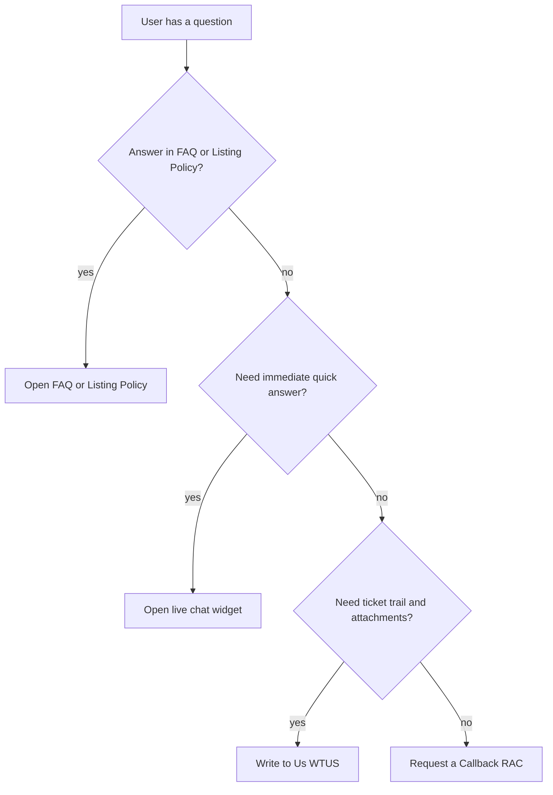

[Auction Journal](../index.md) · [Help And Support](./index.md)

# Getting help — channel guide

Authenticated **auctioneers** and **bidders** can reach Auction Journal support through several channels. This page helps developers and PMs understand **which channel to document or test** for a given user need.

**User guide:** [How do I get help?](../user_side_doc/help-and-support/getting-help.md)

---

## Channel comparison

| Channel | Best for | Ticket ID | Tracked in Ticket History |
|---------|----------|-----------|---------------------------|
| **FAQ** (auctioneer / bidder) | Self-serve answers to common questions | — | No |
| **Listing Policy** (auctioneer only) | Listing rules and policy text | — | No |
| **Request a Callback** | Scheduling a phone call at a preferred date/time | `RAC_*` | Yes — **CALLBACK REQUESTS** tab |
| **Write to Us** (email support) | Detailed issues, attachments, threaded follow-up | `WTUS_*` | Yes — **E-MAIL REQUESTS** tab |
| **Live chat** (Zoho SalesIQ) | Quick questions while using the app | — | No |
| **Live auction webcast chat** | Bidding event chat (not support) | — | No |

---

## Where users open support (navigation)

### Auctioneer (`auctioneer_dashboard_revamp`)

| Entry | Route | Component |
|-------|-------|-----------|
| **Support** → **GET HELP** | `/dashboard/user-support` | `Components/UserSupport/index.jsx` |
| **Support** → **FAQ** | `/dashboard/support/faq` | `Components/UserSupport/Faq/index.jsx` |
| **Support** → **Listing Policy** | `/dashboard/support/listing-policy` | `Components/UserSupport/ListingPolicy/index.jsx` |

Nav definition: `Components/Layouts/navigationLinks.js` (Support submenu).

### Bidder (`auctionjournal-public`)

| Entry | Route | Component |
|-------|-------|-----------|
| **Bid Support** | `/bidder/support` | `Components/Bidder/Bid_Support/index.jsx` |
| **FAQs** | `/bidder/faq` | Separate from Bid Support (sidebar `navData.js`) |

---

## GET IN TOUCH hub (shared UX)

Both apps show **GET IN TOUCH** with three actions:

1. **Request a Callback!** — opens callback modal (see [Callback support](./callback-support.md)).
2. **Write to Us** — navigates to email form (see [Email support](./email-support.md)).
3. **Ticket History** — list and detail views (see [Ticket history](./ticket-history.md)).

Live chat is **not** on this hub; the widget loads globally (see [Live chat](./live-chat.md)).

---

## FAQ and listing policy (adjacent APIs)

Not part of `helpAndSupport.js` ticket routes; mounted on `aj-informations` routes:

| API | Auctioneer client | Bidder |
|-----|-------------------|--------|
| `POST /api/fetchAuctioneerAndBidderFAQ` (`reqType: "1"` auctioneer, `"2"` bidder) | `fetchFAQ` in `lib/api/support/index.js` | Bidder FAQ page |
| `POST /api/fetchListingPolicy` | `fetchListingPolicy` | Not exposed in bidder Bid Support nav |

---

## Decision flow (implementation-neutral)

---

## Related dev docs

- [Callback support](./callback-support.md)
- [Email support](./email-support.md)
- [Live chat (Zoho SalesIQ)](./live-chat.md)
- [Ticket history](./ticket-history.md)
- [Fields](./fields.md)
