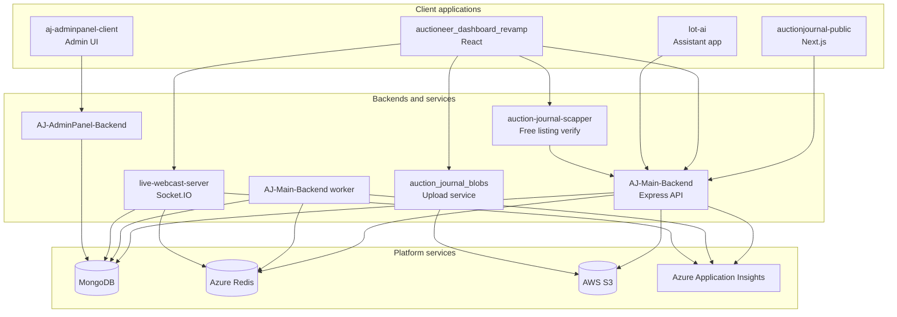
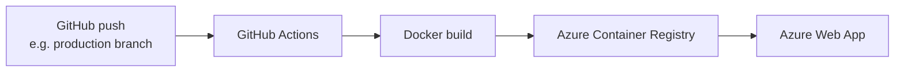

[Auction Journal](index.md)

# System Architecture

Developer-facing overview of Auction Journal (AJ) applications, shared infrastructure, deployment targets, and CI/CD. End-user guides live under [`user_side_doc`](user_side_doc/index.md); they do not duplicate this page.

## Purpose

- Show **which apps exist**, what each one does, and who uses it.
- Describe **shared platform services** (database, cache, storage, observability).
- Document **how code is built and deployed** to Azure.

For domain and feature logic (auctions, listings, payments, etc.), use the module docs linked from [index.md](index.md).

## High-level view

Auction Journal is a **multi-app platform**: several frontends and microservices share **MongoDB** as the system of record, **Redis** for cache and realtime-related state, and **S3** for media and static assets. The **main backend** is the integration hub for most business APIs.

## Applications

| Repository / folder | Stack | Role | Primary users |
|---------------------|-------|------|----------------|
| **AJ-Main-Backend** | Node.js, Express.js | Primary REST API for auctions, listings, bidders, auctioneers, payments, and most platform features. | All customer-facing and auctioneer apps |
| **AJ-Main-Backend** — `worker.js` | Node.js (same repo) | Background jobs: scheduled work, async processing, and other non-request-driven tasks. Runs as a **separate process** (and separate Docker image in production). | Platform (no direct UI) |
| **live-webcast-server** | Node.js, Express, Socket.IO | Realtime server for **onsite / live webcast** auctions: rooms, live bidding events, chat, and ring state. Deployed as its own service (`aj-websocket` image); the main backend repo also exposes `livewebcast-server.js` for local or combined runs. | Auctioneer dashboard, bidders during live webcast |
| **auctioneer_dashboard_revamp** | React, Tailwind, Material UI | Auctioneer CRM: listings, auctions, clerking, clients, settlements, settings. Long-term dashboard (replaces legacy `AJ-Auctioneer-Dashboard`). | Auctioneers and staff |
| **auctionjournal-public** | Next.js, Tailwind, Material UI | Public marketing site and **bidder** experience: browse auctions/listings, register, bid (where applicable), profile. | Bidders, public visitors |
| **auction_journal_blobs** | Node.js, Express.js | Dedicated **upload** microservice for images, videos, and other blobs to **AWS S3** (categorized upload flows). | Dashboard and other clients that upload media |
| **auction-journal-scapper** | Python (Flask, Selenium) | Verifies auctioneer websites for the **“Powered by”** tag to determine **free listing** eligibility; calls main backend APIs to read/update auctioneer status. On-demand from dashboard; recurring checks via scheduler. | Platform automation (triggered from dashboard) |
| **AJ-AdminPanel-Backend** | Node.js, Express.js | APIs for **internal / platform administration** (separate from auctioneer and bidder flows). | Admin operators |
| **aj-adminpanel-client** | Frontend for admin panel | UI for admin operations; consumes **AJ-AdminPanel-Backend**. | Admin operators |
| **lot-ai** | React (Vite), Tailwind, Material UI | **Auctioneer assistant** app: AI-assisted workflows for auctioneer users (separate client from main dashboard). | Auctioneers (assistant use cases) |

### Main backend: three runnable processes

From `AJ-Main-Backend`, operators can run:

| Process | Entry | Purpose |
|---------|--------|---------|
| API | `server.js` | HTTP REST API |
| Worker | `worker.js` | Background jobs |
| Live webcast (in-repo) | `livewebcast-server.js` | Alternate/local entry for webcast; production webcast is typically the **`live-webcast-server`** service image |

Production CI for `AJ-Main-Backend` builds **three** container images: API (`aj-backend-latest`), worker (`aj-backend-worker`), and socket/webcast (`aj-websocket`).

### Integration notes

| From | To | Typical use |
|------|-----|-------------|
| `auctioneer_dashboard_revamp` | `AJ-Main-Backend` | CRUD, auth, business rules |
| `auctioneer_dashboard_revamp` | `live-webcast-server` | Live webcast Socket.IO |
| `auctioneer_dashboard_revamp` | `auction_journal_blobs` | Media uploads |
| `auctioneer_dashboard_revamp` | `auction-journal-scapper` | Free listing **Verify** (`REACT_APP_BASE_URL_SCRAPPER`) |
| `auctionjournal-public` | `AJ-Main-Backend` | Bidder and public data |
| `auction-journal-scapper` | `AJ-Main-Backend` | `GET` / `PATCH` auctioneer free-listing endpoints (API key) |
| `live-webcast-server` | `AJ-Main-Backend` | Persist or validate auction/lot state via HTTP where needed |
| `lot-ai` | `AJ-Main-Backend` | Assistant features backed by platform data |

See [Free listing eligibility](auctioneeer/free-listing-eligibility.md) for scrapper behavior in product terms.

## Deployment and infrastructure

| Component | Technology | Usage in AJ |
|-----------|------------|-------------|
| **Application hosting** | Azure Web Apps | Hosts containerized apps (API, worker, webcast, frontends, blob service, scrapper, admin stack, etc.) |
| **Primary database** | MongoDB | System of record: users, auctions, lots, listings, payments metadata, and related documents |
| **Cache / realtime support** | Azure Redis | Caching, session-related data, and patterns used by API, worker, and live webcast |
| **Object storage** | AWS S3 | Images, videos, and static/blob files (via `auction_journal_blobs` and backend references) |
| **Observability** | Azure Application Insights | Logging, metrics, and monitoring across deployed services |

Environment-specific URLs, connection strings, and secrets are configured per app (`.env` / Azure app settings); this doc does not list secret names.

## CI/CD

Delivery follows a common pattern across repositories:

| Step | Tool | What happens |
|------|------|----------------|
| Source control | GitHub | App repos live in GitHub; merges to deploy branches trigger pipelines |
| Build & test | GitHub Actions | Workflows under `.github/workflows/` (e.g. `build-and-push.yml`) |
| Containerization | Docker | Each deployable app has a `Dockerfile` (main backend also uses `Dockerfile.worker`, `Dockerfile.websocket`) |
| Registry | Azure Container Registry (ACR) | Images tagged and pushed (e.g. `aj-backend-latest`, `aj-backend-worker`, `aj-websocket`) |
| Runtime | Azure Web App | Pulls images from ACR and runs the corresponding service |

**Example:** `AJ-Main-Backend` on push to `production` logs into Azure, builds API + worker + socket images, pushes to ACR, and Web Apps consume those images. Other apps (`auctionjournal-public`, `auctioneer_dashboard_revamp`, `auction_journal_blobs`, `lot-ai`, `aj-adminpanel-client`, `auction-journal-scapper`, etc.) follow the same **Actions → Docker → ACR → Web App** pattern with repo-specific image names.

## Related documentation

| Topic | Location |
|-------|----------|
| Workspace app list (short) | [`../README.md`](../README.md) |
| Main backend run/setup | [`../AJ-Main-Backend/README.md`](../AJ-Main-Backend/README.md) |
| Feature and business logic | [index.md](index.md) |
| Live webcast (product) | [auction/onsite-livewebcast/index.md](auction/onsite-livewebcast/index.md) |
| Free listing / scrapper | [auctioneeer/free-listing-eligibility.md](auctioneeer/free-listing-eligibility.md) |

## Legacy (out of scope for new work)

`AJ-Auctioneer-Dashboard` and folders under `aj_backup_oldcodes` are historical; new development targets **`auctioneer_dashboard_revamp`** and current backends above.
